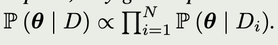
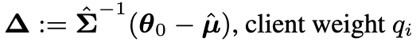
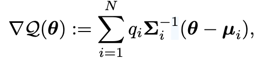
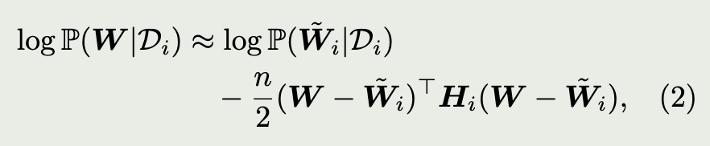
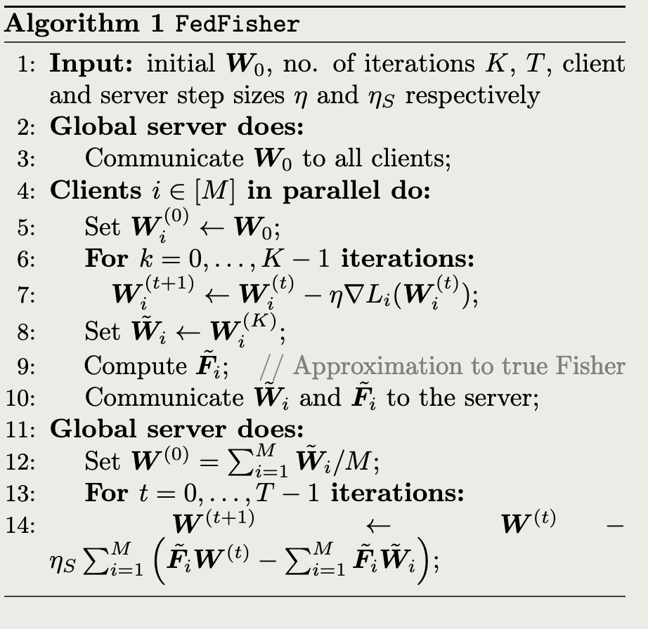
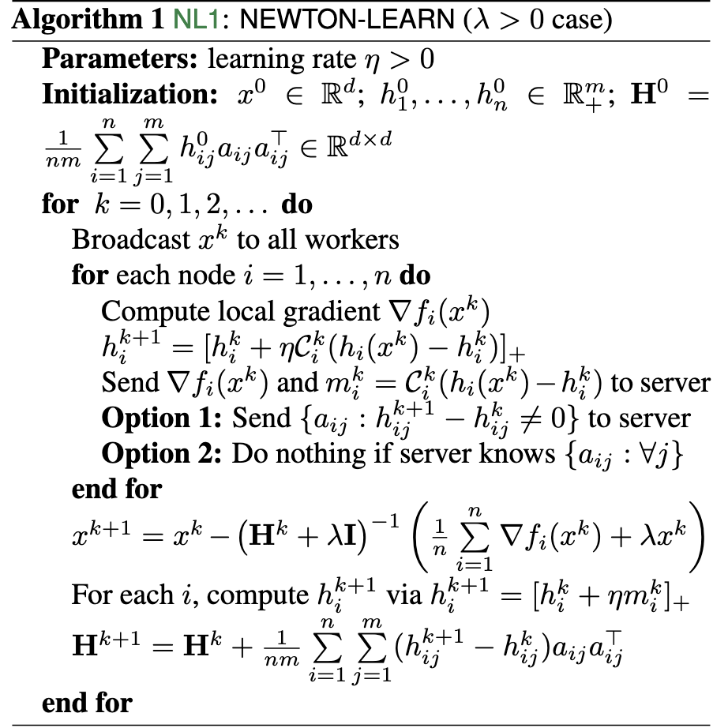
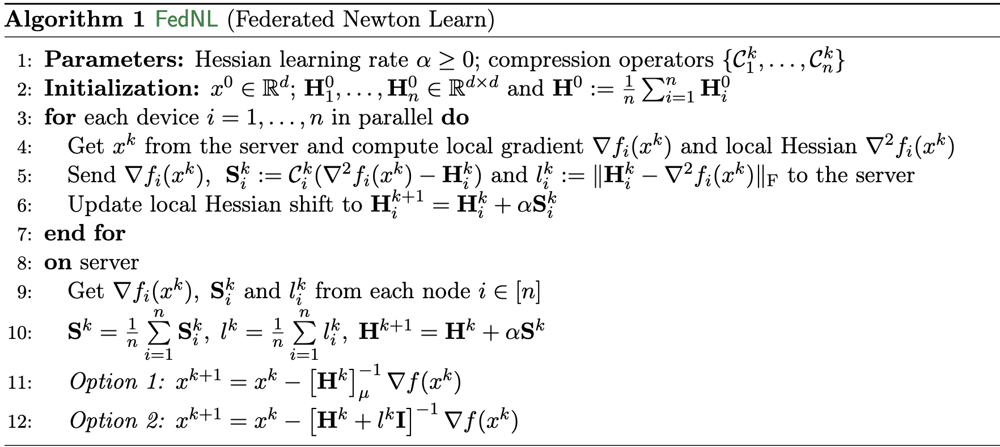
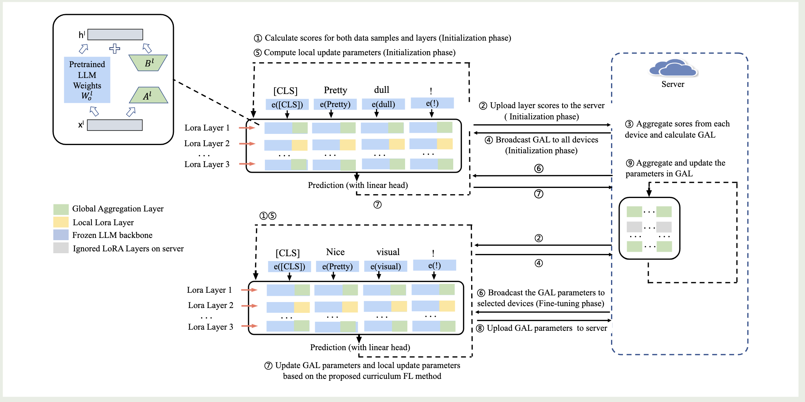

# Second-order optimization for FL

## POSTERIOR AVERAGING

1. FedPA (2021)

[1] M. Al-Shedivat, J. Gillenwater, E. Xing, and A. Rostamizadeh, “Federated Learning via Posterior Averaging: A New Perspective and Practical Algorithms,” arXiv.org. Accessed: Apr. 17, 2024. [Online]. Available: https://arxiv.org/abs/2010.05273v4

**Brief description** : Under the uniform prior, any global posterior distribution that exists decomposes into a product of local posteriors,

(i) infer approximate local means and covariances, (stochastic gradient Markov chain Monte Carlo)
(ii) communicate these to the server, 

and (iii) compute the posterior mode

2. FedFisher(2024)

[1] D. Jhunjhunwala, S. Wang, and G. Joshi, “FedFisher: Leveraging Fisher Information for One-Shot Federated Learning,” Mar. 18, 2024, arXiv: arXiv:2403.12329. Accessed: Apr. 04, 2024. [Online]. Available: http://arxiv.org/abs/2403.12329

**Brief description** : no necessary to compute local means and covariances, only local weights and Fisher needs.

send local weights and Fishers to server,

## Newton-Type

[1] R. Islamov, X. Qian, and P. Richtarik, “Distributed Second Order Methods with Fast Rates and Compressed Communication,” in Proceedings of the 38th International Conference on Machine Learning, PMLR, Jul. 2021, pp. 4617–4628. Accessed: May 28, 2024. [Online]. Available: https://proceedings.mlr.press/v139/islamov21a.html

**Brief description** : The client sends the compressed changes of parts of the Hessian matrix and the local gradients to the server. The server then updates the overall Hessian matrix and uses the local gradients to obtain the global parameters.

[2] M. Safaryan, R. Islamov, X. Qian, and P. Richtárik, “FedNL: Making Newton-Type Methods Applicable to Federated Learning,” May 22, 2022, arXiv: arXiv:2106.02969. Accessed: Apr. 23, 2024. [Online]. Available: http://arxiv.org/abs/2106.02969

## (FibecFed) J. Liu et al., “Fisher Information-based Efficient Curriculum Federated Learning with Large Language Models,” Sep. 30, 2024, arXiv: arXiv:2410.00131. Accessed: Oct. 15, 2024.

Federated Learning (FL) can be exploited to fine-tune Large Language Models (LLMs) without aggregating the raw data from a large number of devices

parameter-efficient approaches for reducing the number of parameters within the fine-tuning process of LLMs

- Prompt tuning
  - Low-Rank Adaptation (LoRA)
  h = W * x +  A * B *x
  - takes unaffordable time to update the low-rank parameters of all the layers in LLMs when dealing with decentralized data.

- curriculum learning
  - the curriculum training process starts with easier data and then gradually increase the difficulty. Instead of randomly sampling the batch from training dataset, curriculum learning allows the model to gradually learn from easy samples to hard samples during the training or the fine-tuning process.
  - existing methods cannot provide an accurate estimation of difficulty of data samples and cannot be directly applied in FL.
    - In the context of FL, the data is generally non-Independent and Identically Distributed (non-IID), which requires an adaptive difficulty evaluation approach for diverse devices.

### Methods

(1) : Compute layer important score by calculating the output difference of a certain layer with two similar input data samples to indicate its resilience, which represents the importance score.
and choose the most important N layers as GAL
(7) : Apart from the parameters in GAL, we dynamically select an important part of parameters in other layers to update.
exploit a neuron-wise aggregation of the FIM to indicate the importance score of Neuron μ in Layer l

did not use 2nd-order info in local or server side weight update.
