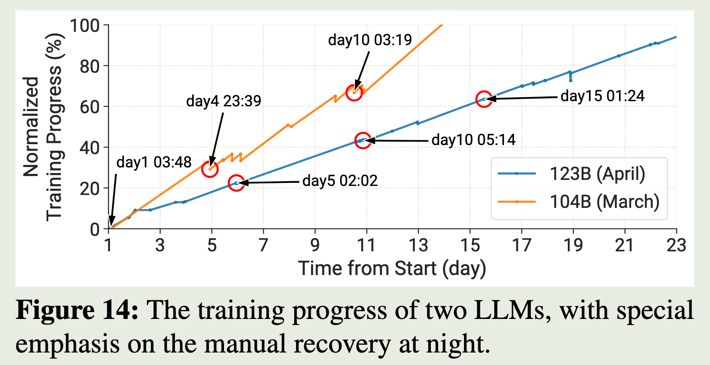

# Distributed Learing

## Characterization of Large Language Model Development in the Datacenter

we present an in-depth characterization study of a six-month LLM development workload trace collected from our GPU datacenter Acme.

the divergent characteristics and requirements of LLMs

**Paradigm Transition**
DL workloads generally follow a task-specific paradigm that trains the model on domainspecific data to tackle a particular task (e.g., translation [18]). In contrast, LLMs follow an emerging paradigm that performs self-supervised training on broad data to generate a foundation model [19] and further adapts to a wide range of downstream tasks.

**Tailored Software Stack**
**Unified Architecture**

- Prior DL workloads usually employ various model architectures
- In contrast, LLMs commonly embrace the Transformer [93] architecture

### Key findings

**Shorter Job Duration and Unfair Queuing Delay**
be attributed to the presence of numerous short-term tasks such as evaluation
We observe that **evaluation jobs**, despite being short-term and small-scale, have **the longest queuing delay**. This discrepancy stems from reserving the majority of resources for pretraining jobs to minimize their queuing delays. **Evaluation jobs are scheduled with a lower priority**, utilizing the limited spare resources.

**Long GPU Idle Time in Evaluation Workload.**
Our profiling of evaluation workloads reveals substantial underutilization of GPU resources at various stages.
For example, the evaluation job on HumanEval consumes 29.5% of its time for **model loading and data preprocessing**,
and an additional 19.0% is spent **conducting synthesized program correctness tests.**
As a result, **only half of the time is dedicated to GPU inference**, leading to long queuing delays in evaluation trials.

**Frequent Job Failures.**

- various errors primarily occur at the beginning of LLM workloads
- infrastructure failures, which are common in long-term pretraining jobs, significantly impede training efficiency

**challenges**

unstable training progress, remote storage bottleneck and delayed feedback on model performance.

### LLM Development Pipeline

1. Data Preparation
   1. pretraining data: consisting of extensive unlabeled corpora obtained from public or private sources
   2. alignment data: comprising a smaller set of high-quality labeled corpora used to align the model with specific tasks.
2. Pretraining.
   1. self-supervised training on largescale curated data
3. Alignment: to adapt LLMs with user intent on a wide range of downstream tasks
   1. prompt engineering,
   2. fine-tuning
4. Evaluation

### Datacenter Characterization

#### LLMs versus Prior DL Workloads

1. Shorter Job Duration
   1. Hardware upgrade
   2. Extensive associated workloads: LLM development pipeline involves numerous small-scale associated jobs, such as evaluation.
   3. High incompletion rate: Approximately 40% of jobs fail, with completed jobs consuming only 20∼30% of GPU resources.
2. Polarized GPU Utilization
3. High-skewed Workload Distribution.
   1. singleGPU jobs only account for less than 2% resources in our two clusters.
   2. large-scale jobs (≥ 256 GPUs) dominated the GPU time in Kalos, occupying more than 96% of resources.
   3. This highlights the critical need for a scheduling system tailored for LLM clusters
4. Workload Categories
   1. Irrelevance of Job Count and Resource Usage.
      1. It is obvious that evaluation jobs constitute the majority of the total job count in both clusters, yet they consume a relatively small portion of resources (0.8% in Kalos). In contrast, pretraining jobs only account for 0.9% and 3.2% of the total job count but consume 69.5% and 94.0% of the total GPU time in Seren and Kalos respectively.
   2. Job Type Correlates with GPU Demand.
   3. Similar Temporal Distribution.
      1. less than 5% jobs last for over 1 day in both clusters. This can be attributed to frequent failures during pretraining
      2. evaluation jobs have the longest queuing delay. 
         1. Evaluation jobs are typically submitted as a batch simultaneously with lower priority, utilizing the limited spare resources.

#### Infrastructure

1. Higher GPU Utilization
   1. in Kalos indicate that 50% of GPUs consume over 75% of GPU memory (60 GB).
   2. the median SM activity in both clusters is approximately 40%
   3. memory-intensive and computeintensive natures of LLMs.
2. Underutilized Associated Resources
   1. CPU memory utilization remains below 50%.
   2. Additionally, due to a high CPU-to-GPU ratio (16 CPUs per GPU), CPUs are typically underutilized,
   3. We observe that NICs remain idle for over 60% of the time, and the active bandwidth rarely surpasses 25% of the maximum bandwidth provided by IB.
3. Environmental Impact
   1. We observe that around 30% of GPUs are in an idle state and still need to consume 60W.
   2. 22.1% and 12.5% of GPUs consume over 400W (TDP) in Seren and Kalos respectively, with some even reaching 600W.
   3. GPU servers consume 5× power than CPU servers on average

#### Workload Profiling

MegatronLM + Zero

##### Pretraining Workload

1. GPU SM Utilization.
   1. The relatively low utilization of 3D parallelism is mainly due to the impact of communication introduced by hybrid parallelism on the critical path, such as bubbles in pipeline parallelism.
2. GPU Memory Footprint.
3. Imbalance in Activation Sizes.

### Failure Category

1. Infrastructure
2. Framework
3. Script
   1. They constitute the majority of failures and are often addressed by revising codes.

#### Failure Characterization

1. Infrastructure Failures Cause Most Severe Impact
   1. They take over 82% GPU resources (GPU Time) with only 11% failed job quantity (Num).
   2. Most of these jobs are long-term pretraining tasks that can experience hardware failures multiple times
2. Failures Caused by High Temperature.
   1. Another noteworthy observation is that training 7B models in Kalos tend to result in GPU overheating, which can cause NVLinkError or ECCError.
   2. the overall temperature in the cluster server room increased by approximately 5◦C when training these models.
   3. we find most of these jobs occurred in July 2023, which is the hottest month on record
3. Many Failures Induced by Auxiliary Services.
4. Evaluation Jobs Rarely Encounter Errors.

#### Failure Recovery

There are three scenarios where we should restart a job: 

- (1) when an error occurs within the job, 
- (2) when there are anomalies in training metrics such as a loss spike, and 
- (3) when the training process is stuck.

### Deployed LLM Systems

(1) Pretraining: enhancing fault tolerance through LLM-involved failure diagnosis and automatic recovery.
(2) Evaluation: achieving prompt performance response via task decomposition.

#### Fault-tolerant Pretraining

**Motivation**
failures are inevitable and frequently occur due to the substantial number of GPUs involved and the extensive duration of the training process

**System Design**

1. Asynchronous Checkpointing
   1. Our observations indicate that the CPU memory is capable of accommodating several checkpoints.
   2. store the model state in memory and utilize a separate thread to regularly save these states to remote persistent storage.
2. Failure Diagnosis
   1. incorporate an LLM with rule-based diagnosis to achieve efficient and accurate failure diagnosis
      1. Real-time Log Compression
         1. The system continuously updates a collection of regular expressions, termed as Filter Rules.
            1. remove regular log outputs
         2. the LLM-based Log Agent dynamically writes regular expressions to update the Filter Rules
      2. LLM-assisted Automated Diagnosis
3. Fast Fault Detection and Recovery.
   1. infrastructure failure : to identify the problematic nodes
   2. loss spike : opt to an earlier healthy restart checkpoint and bypass subsequent data batches.

#### Decoupled Scheduling for Evaluation

Motivation: Using a single metric like training loss is insufficient to evaluate LLMs. Diverse tasks and metrics are necessary. The framework performs frequent evaluations during pretraining, but evaluation jobs suffer from long queue delays due to limited resources.

System Design: A trial coordinator is introduced to improve evaluation efficiency using three key techniques:

1. Decoupling Remote Model Loading: Model loading is separated from evaluation. Models are preloaded into local memory before evaluation tasks run, reducing load contention and time.
2. Decoupling Metric Computation: After inference, outputs are saved immediately and metric computations are offloaded to CPU jobs, reducing GPU idle time.
3. Prior-based Elastic Scheduling: By leveraging prior knowledge of evaluation runtimes, tasks are grouped or split to maximize GPU usage and reduce scheduling overhead.

System Performance: In an evaluation involving a 7B model across 63 datasets, the trial coordinator reduced total makespan by 1.3× with one node and 1.8× with four nodes.

This chapter presents a comprehensive characterization of LLM workloads in the Acme datacenter. It compares them with prior DL workloads from other datacenters (like Microsoft Philly, SenseTime Helios, and Alibaba PAI). Key aspects include workload duration, job types, resource usage, and failure patterns.