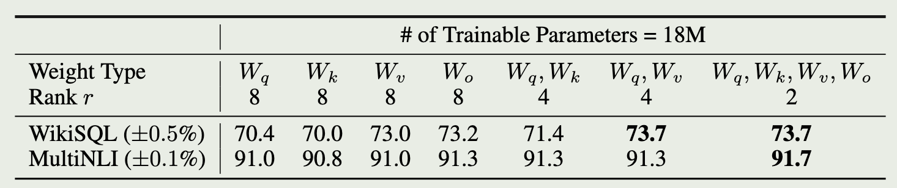

# Other Topics about LLM & NN & DL

## LORA: LOW-RANK ADAPTATION OF LARGE LANGUAGE MODELS

LoRA allows us to train some dense layers in a neural network indirectly by optimizing rank decomposition matrices of the dense layers’ change during adaptation instead, while keeping the pre-trained weights frozen

**AREN’T EXISTING SOLUTIONS GOOD ENOUGH?**

- Adapter Layers Introduce Inference Latency

- Directly Optimizing the Prompt is Hard

### Methods

When adapting to a specific task, Aghajanyan et al. (2020) shows that **the pre-trained language models have a low “instrisic dimension” and can still learn efficiently despite a random projection to a smaller subspace.**

$$
y = (W_0 + B \cdot A) x ; g_B = \frac{\partial L}{\partial B}, \quad g_A = \frac{\partial L}{\partial A}
$$

$$
A \gets A - \eta \cdot g_A, \quad B \gets B - \eta \cdot g_B
$$

### UNDERSTANDING THE LOW-RANK UPDATES

**WHICH WEIGHT MATRICES IN TRANSFORMER SHOULD WE APPLY LORA TO?**

Adapting both Wq and Wv gives the best performance overall.

This suggests that even a rank of four captures enough information in ∆W such that it is preferable to adapt more weight matrices than adapting a single type of weights with a larger rank.

**WHAT IS THE OPTIMAL RANK r FOR LORA?**

suggests that a low-rank adaptation matrix is sufficient.

**HOW DOES THE ADAPTATION MATRIX ∆W COMPARE TO W ?**

First, ∆W has a stronger correlation with W compared to a random matrix, indicating that ∆W amplifies some features that are already in W .
Second, instead of repeating the top singular directions of W , ∆W only amplifies directions that are not emphasized in W .
Third, the amplification factor is rather huge

the low-rank adaptation matrix potentially amplifies the important features for specific downstream tasks that were learned but not emphasized in the general pre-training model.

## Attention Is All You Need

The goal of reducing sequential computation

the number of operations required to relate signals from two arbitrary input or output positions grows in the distance between positions

Encoder: 

1. multi-head self-attention mechanism
2. MLP
3. layer normalization

Decoder:

In addition to the two sub-layers in each encoder layer, the decoder inserts a third sub-layer, which performs multi-head attention over the output of the encoder stack.

### Attention

An attention function can be described as mapping a query and a set of key-value pairs to an output, where the query, keys, values, and output are all vectors.

## Efficient Training of Large Language Models on  Distributed Infrastructures: A Survey

- The original attention mechanism, known as Multi-Head Attention (MHA) [10], suffers from quadratic computational complexity and high memory consumption due to the key-value cache.
  - several variants such as Multi-Query Attention (MQA) [11], GroupQuery Attention (GQA) [12] and Multi-Latent Attention (MLA) [13] have been proposed. 
- A notable advancement of the FFN component
  - Mixture-of-Experts (MoE)

### LLM Training Workloads Characteristics

- Homogeneous Model Architecture.
  - all share this common foundation
- Unprecedented Scale and Training Duration.
  - fault tolerance and checkpoint
- Shift in Training Paradigm.
  - LLMs adopt a self-supervised training approach on extensive datasets to create foundation models, which are then adapted for various downstream tasks.

The efficiency can be measured with MFU (Model FLOPs Utilization)

### Network Infrastructure

- Chip-to-Chip Communications
  - Cube-Mesh Topology.
  - Fully-Connected Topology.
    - Many interconnects utilize either switch-based or P2P-based fully connected topologies to improve chip-to-chip communication performance.
    - NVSwitch
  - 3D-torus.
    - TPUv4
- Node-to-Node Communications
  - Remote Direct Memory Access
  - InfiniBand
    - EDR (Enhanced Data Rate) at 100 Gbps to HDR (High Dynamic Range) at 200 Gbps, and more recently to NDR (Next Data Rate) at 400 Gbps per link
  - RoCE
- Network Topology
  - HPC Network Topology
  - Training-Optimized Topology.
    - The rail-optimized topology
      - rail-optimized network designs could be less efficient because they necessitate connecting GPUs to distant switches, which requires costly and power-hungry optical transceivers.
  - Reconfiguable Topology.
- Load Balancing
  - ECMP (Equal-Cost Multi-Path routing)
    - However, this hash-based scheme is inefficient for handling LLM training traffic, which consists of a small number of elephant flows. When multiple elephant flows are routed to the same link, it can result in congestion and high latency.
- Storage
  - Storage Systems for Checkpoint
    - Tectonic
    - ByteDance 's HDFS 
    - Ceph Object Storage
  - Storage Systems for Training Data
    - Quiver [91] supports the transparent reuse of cached data across multiple jobs and users operating on the same dataset.
    - Fluid [92] leverages Alluxio for data caching, incorporating a mechanism that enables on-the-fly autoscaling of the cache based on I/O conditions.
- Scheduling
  - Workload Scheduling
    - heterogeneous-aware schedulers
    - job-packing schedulers (e.g., FGD [98], Lucid [99]) enable fine-grained GPU sharing to fully facilitate hardware capability;
  - Resource Scheduling

### PARALLELISM SCHEMES FOR LLM TRAINING

Single Program Multiple Data (SPMD) programming model
Multiple Program Multiple Data (MPMD) model

#### Hybrid Parallelism

data parallelism, tensor parallelism, pipeline parallelism and sequence parallelism

The combination of data parallelism, tensor parallelism, and pipeline parallelism is also referred to as 3D parallelism.

- Data parallelism
  - Full replication
    - DDP
    - Horovod
  - Full sharding
    - ZeRO-3 
    - Sharded Weight Update ###
  - Hybrid sharding
    - “Pytorch fsdp
    - MiCS
    - FSDP 
- Tensor parallelism
- 